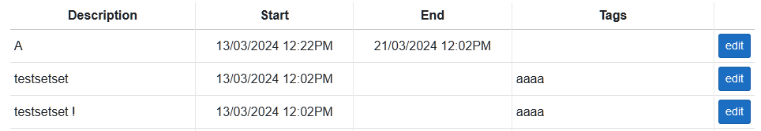
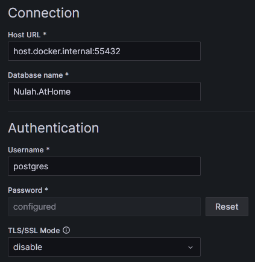
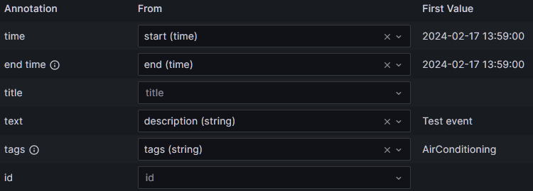

# Basic Events Overview
Basic events is designed for what it says on the tin: a means to create basic events with a description, start date, optional end date, and optional tags.

This was primarily designed to provide a means to create and manage events for use with Grafana annotations. Of course you can use them for whatever you want via the Postgres database directly.

They can exist as is for the front end and be available in the table.


Or alternatively, they can be used as a source for Grafana annotations.

Simply add the database as a data source in Grafana (this is not a Grafana tutorial), as required. The example below is assuming that you're running AtHome within docker on the same machine so `host.docker.internal:mappedport` is in use. Just use whatever connection you use for AtHome for your data source and once you click Save & Test you should see a successful connection. If you don't it's up to you to try and solve this issue, as this also isn't a Postgres tutorial.


Once you successfully have your data source added, you can now proceed to any Grafana dashboard, then go Settings > Annotations -> + New Query and select your AtHome Postgres datasource.

Once added, the following query will provide you the minimum for annotations with mappings for display
```sql
SELECT basic_events.description
, basic_events.start
, coalesce(basic_events."end",basic_events.start) as "end"
, string_agg(tags.name,',') as tags
FROM basic_events
LEFT JOIN basic_event_tag ON basic_event_tag.events_id = basic_events.id
LEFT JOIN tags ON tags.id = basic_event_tag.tags_id
GROUP BY basic_events.id
```


You'll note we have a `coalesce()` for end time. This is due to a slight _quirk_ in Grafana's annotation system where if the end time is null, annotations will not display correctly and as a result will not display correctly. Even though the same query without `coalesce()` will show rows correctly in data explorer, the annotation feature does ????? and will cause annotations to display incorrectly if they're the only annotation visible due to this.

This is not a flaw in AtHome, it's a Grafana related quirk with annotations.